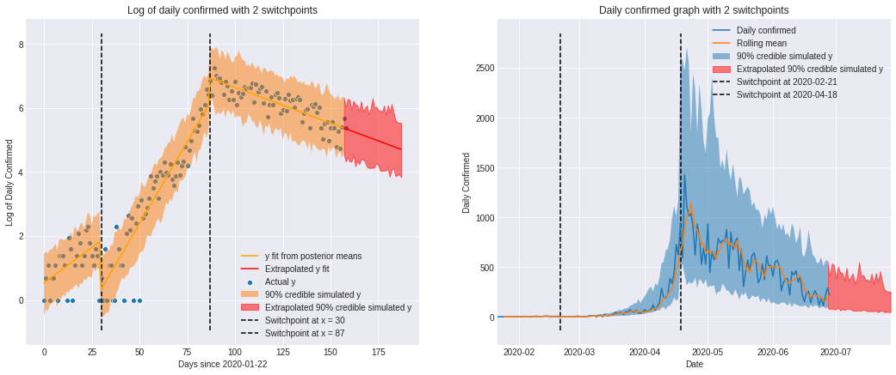
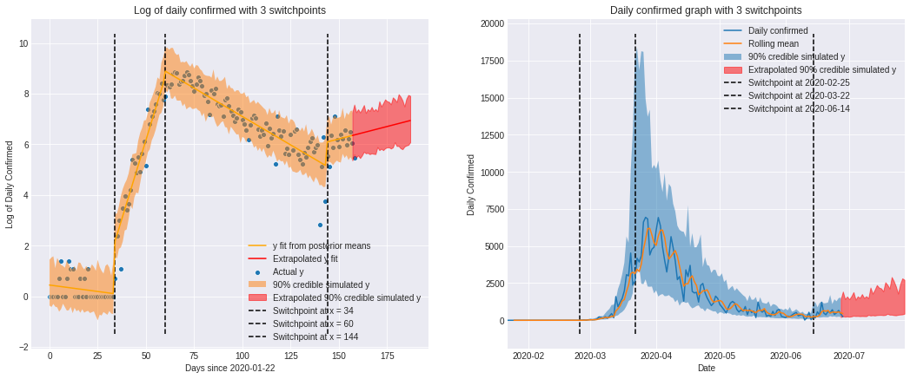

COVID-19 analysis with K change points using a segmented bayesian regression model
==================================================================================

## Disclaimer
This is by no means a valid or peer-reviewed analysis of the COVID-19 outbreak. Opinions or assumptions expressed in this document and project are my own.

## Examples
### Singapore (as of 28-06-2020)

- The first segment, prior to 21-02-2020, shows Singapore's initial aggressive response to the virus.
- From 21-02-2020 to 18-04-2020, Singapore's cases rose exponentially, possibly due to a large number of imported cases and it's spread in Europe.
- From 18-04-2020 to 28-06-2020, the change in trend can be associated with a call to a "circuit breaker" which started 07-04-2020.

### Germany (as of 28-06-2020)

- It is observed that similar to Singapore, the virus started spreading quickly from 25-02-2020.
- The change to a downward trend is observed after 22-03-2020, after a series of aggressive measures similarly taken by the German government, and a lockdown introduced in Baravia in 20-03-2020.
- From the start of June, various states began lifting lockdown measures, possibly attributing to a slight increase in cases identified in the switchpoint at 14-06-2020.

## Motivation
Focusing on the COVID-19 spread in Germany and Singapore, I detect change points in the raw data of number of confirmed daily cases by running the data through a segmented regression model with K arbitrary "switchpoints" that are learned by the model. The change points in the effective growth rate correlate well with the time of publicly announced tightening or easing of lockdown/ social distancing measures. The aim of this project is to quantify the effect of interventions and extrapolate the exponential model into the future for forecasting purposes.

## Data
The data accrued is publicly hosted on Kaggle: https://www.kaggle.com/imdevskp/corona-virus-report/data?select=covid_19_clean_complete.csv

## Code
The python class in `KSegmentsModel.py` encapsulates the model and data visualisation tools necessary for analysis. Examples of the resultant output are shown in the [Examples](#examples) section. Usage of the class is shown in [Workbook 2](https://gist.github.com/gdlow/09126308268ffd0b53969e86dcb243e7).

## Colab notebooks
- [Workbook 1](https://gist.github.com/gdlow/cca28b6d36ec806355b9330bf31f42d9)
- [Workbook 2](https://gist.github.com/gdlow/09126308268ffd0b53969e86dcb243e7)

## How it works

The data is first parsed into the correct format by including a DataFrame column that includes the daily confirmed counts in each country. Under the assumption that the virus spreads exponentially, I created another column that computes the log of this data, allowing for linear analysis. I then fit a segmented linear regression model using pymc3 on the given data. The segmented linear regression model allows for an arbitrary number of K switchpoints by nesting together a bunch of switch statements identifying the changes in trend in the given observations. I then transform the fitted model, along with it's 90% credible intervals, back to the raw data of daily counts, and further extrapolate the model `days_after` days into the future for forecasting purposes.